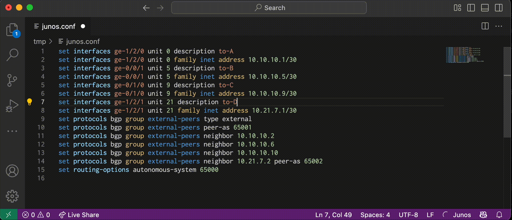

# Junos Extension for Visual Studio Code

Junos extension for Visual Studio Code is a language server that provides auto-completion, validation, and syntax highlighting for Junos.

## Features

The language server has the following language features:

* Completion
* Syntax validation
* Syntax highlighting
  * Thanks to woodjme's [vscode-junos-syntax](https://github.com/woodjme/vscode-junos-syntax)

### Experimental Features

:warning: These features may work, but still under development. The behavior might be changed :warning:

* Go To Definition
  * `interface`
  * `prefix-list`
  * `policy-statement`
  * `community`
  * `as-path`
  * `as-path-group`
  * `firewall-filter`

## Screen Shot

## Copyright and License

Copyright (c) 2019 Shintaro Kojima. Code released under the [MIT license](LICENSE.txt).
